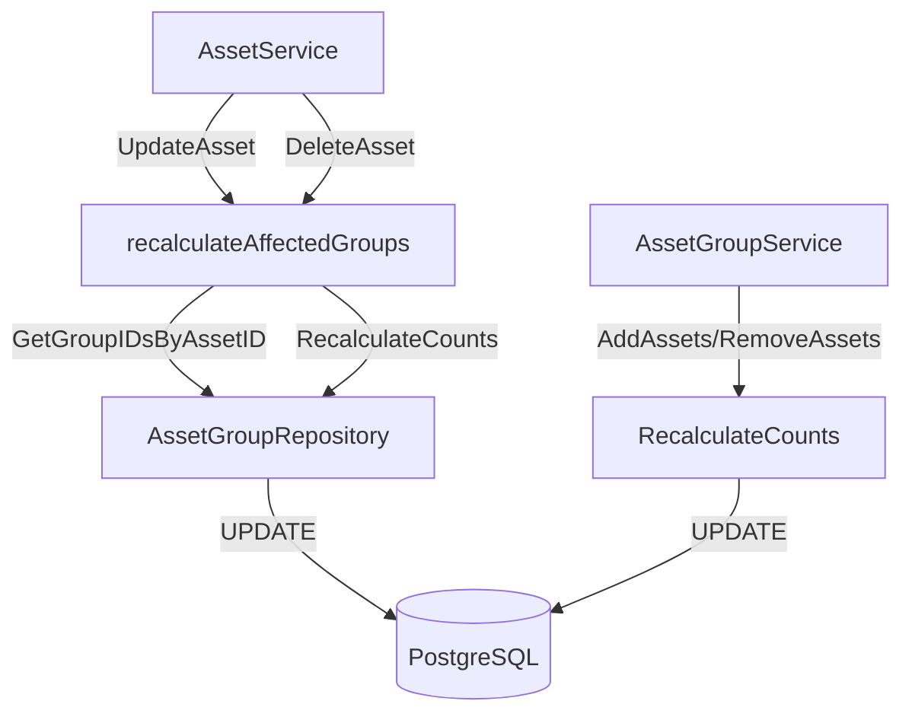
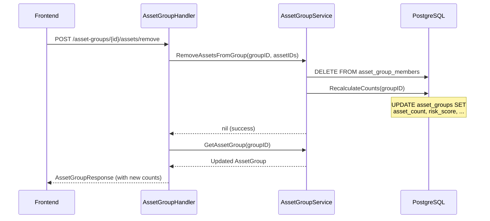
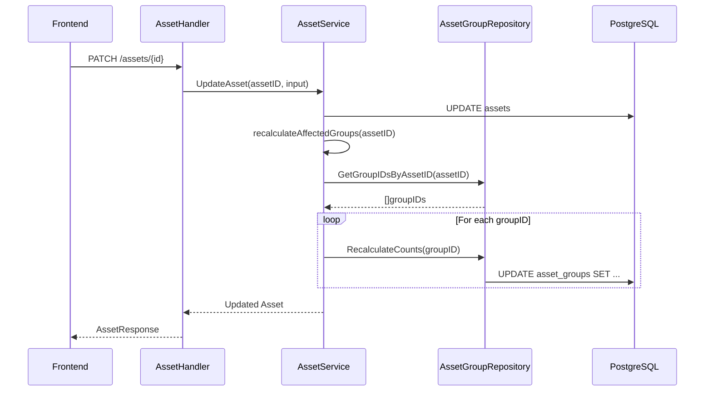

# Asset Group Stats Recalculation

## Overview

Asset groups maintain cached statistics (`asset_count`, `risk_score`, `finding_count`, etc.) that are automatically recalculated when assets change.

## Scenarios

| Scenario | Trigger |
|----------|---------|
| Create group with assets | `AssetGroupService.CreateAssetGroup` |
| Add assets to group | `AssetGroupService.AddAssetsToGroup` |
| Remove assets from group | `AssetGroupService.RemoveAssetsFromGroup` |
| Update asset | `AssetService.UpdateAsset` |
| Delete asset | `AssetService.DeleteAsset` |

## Architecture



## Flow: Remove Assets from Group



## Flow: Update Asset



## Implementation Details

### Key Components

- **`AssetGroupRepository.RecalculateCounts`**: Updates all cached stats using SQL aggregations
- **`AssetGroupRepository.GetGroupIDsByAssetID`**: Finds groups containing a specific asset
- **`AssetService.recalculateAffectedGroups`**: Helper that triggers recalculation for all affected groups

### Cached Fields

```sql
asset_count        -- Total assets in group
domain_count       -- Assets of type 'domain'
website_count      -- Assets of type 'website'
service_count      -- Assets of type 'api' or 'service'
repository_count   -- Assets of type 'repository'
cloud_count        -- Assets of type 'cloud' or 'container'
credential_count   -- Assets of type 'credential'
risk_score         -- AVG(asset.risk_score)
finding_count      -- SUM(asset.finding_count)
```
