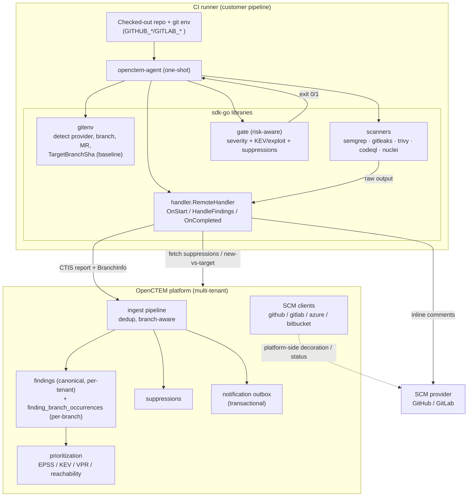
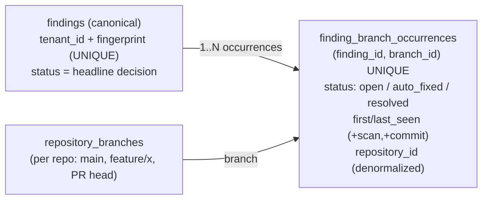

# Shift-Left CI/CD Code Scanning (agent-first)

> Self-contained SAST/SCA/secret scanning in the pipeline → CTIS ingest →
> branch-aware findings → **risk-aware gate** + **PR/MR decoration**. Design:
> [RFC-008](../rfcs/RFC-008-native-shift-left-ci-scanning.md). Complements
> [Scan Orchestration](scan-orchestration.md) (platform-run scanners) — this doc
> covers the **CI-runner** scanning path.

OpenCTEM runs its **own** agent in the customer's CI (no third-party tool, no
bridge). The agent detects the CI environment, runs scanners on the checked-out
code, pushes CTIS, then gates the build by **real risk** (EPSS/KEV/VPR), not just
severity — and comments findings inline on the PR/MR.

## 1. Component structure



## 2. End-to-end data flow (one PR scan)

```mermaid
sequenceDiagram
  participant CI as CI runner
  participant AG as openctem-agent
  participant SCAN as scanner (semgrep/…)
  participant API as OpenCTEM API
  participant SCM as GitHub/GitLab

  CI->>AG: run (auto-detect CI env)
  AG->>AG: gitenv → repo, commit, branch, MR, TargetBranchSha
  AG->>API: OnStart(scan) → ScanInfo{baseline LastCommitSha}
  AG->>SCAN: scan (ChangedFileOnly for PRs)
  SCAN-->>AG: raw findings
  AG->>AG: parse → CTIS report + BranchInfo
  AG->>API: HandleFindings (PushFindings: CTIS)
  API->>API: dedup by fingerprint; upsert finding_branch_occurrences (this branch)
  API->>API: auto-resolve ONLY on default branch + full coverage (canonical safe)
  API-->>AG: suppressions (+ Phase 3: new-vs-target set)
  AG->>SCM: inline PR/MR comments (new findings on changed files)
  AG->>AG: gate: block if finding ≥ threshold OR KEV/exploit (minus suppressed)
  AG-->>CI: exit 0 (pass) / 1 (fail)
```

## 3. Finding storage: repo vs branch

A finding has **branch-independent identity** (`findings`, unique
`tenant_id + fingerprint`); per-branch presence lives in
`finding_branch_occurrences`. One finding on `main` **and** a feature branch =
**one** `findings` row + **two** occurrence rows — cross-branch correlation
preserved, per-branch lifecycle enabled.



**Invariants**
- Canonical `findings.status` changes **only** from a **default-branch, full-coverage** scan (feature/PR scans write occurrences only). Protects against a feature branch mass-resolving real findings.
- Default-branch flag is never silently re-pointed on ingest (anti-abuse).
- Auto-resolve is scoped (tool × scan × assets/branch) — a partial/PR scan never resolves findings outside its scope.

## 4. Component responsibilities

| Component | Responsibility |
|---|---|
| `sdk-go/pkg/gitenv` | Detect CI provider + repo/commit/branch/MR/baseline; post MR comments |
| `sdk-go/pkg/handler` | Scan lifecycle (OnStart/HandleFindings/OnCompleted); push CTIS; orchestrate comments |
| `sdk-go/pkg/scanners` | Run + parse each scanner → CTIS |
| `agent/internal/gate` | **Risk-aware** CI gate: severity threshold + KEV/exploit override + suppressions → exit code |
| api ingest | Dedup, branch-aware occurrence write, scoped auto-resolve |
| api prioritization | EPSS/KEV/VPR enrichment (feeds risk-aware gate + views) |
| api SCM clients | Repo/branch read; (Phase 4) platform-side PR decoration |
| api outbox | Reliable notifications (digest, alerts) |

## 5. Phase status (see RFC-008)

| Phase | Scope | Status |
|---|---|---|
| 1 | Risk-aware gate (KEV/exploit below threshold) | **Done** — agent #27 |
| 2 | Per-branch occurrence lifecycle (auto_fixed on non-default) | Planned |
| 3 | MR new-vs-target suppression | Planned |
| 4 | PR comment idempotency + provider parity | Planned |
| 5 | Per-branch read surface (finish occurrence reads) | Planned |
| 6 | Reporting export (PDF/Excel) + weekly digest + role routing | Planned |
| 7 | DX: GitHub Action / GitLab CI recipes + docs | Planned |

## 6. Code map
```
sdk-go/pkg/gitenv/                          CI env detect + MR comment
sdk-go/pkg/handler/{handler,remote}.go      scan lifecycle + push + comments
sdk-go/pkg/scanners/{semgrep,gitleaks,...}  run + parse → CTIS
agent/main.go runOnce                        CI one-shot flow
agent/internal/gate/security.go              risk-aware gate (Phase 1)
api internal/app/ingest/processor_findings.go  occurrence write (Step 6)
api internal/app/ingest/service.go           default-branch + full-coverage auto-resolve gate
migrations/000173_finding_branch_occurrences.up.sql  per-branch occurrence model
```
